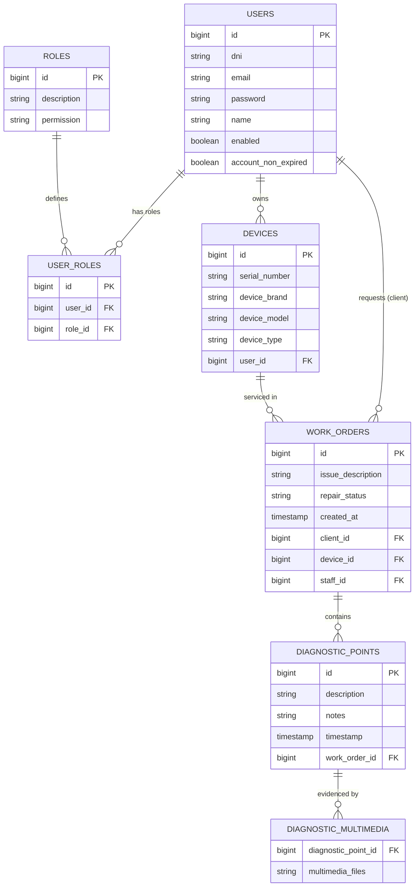

# Viking App - Backend API


> **Backend Service for the Viking App Ecosystem**
> Empowering technical service workflow with robust job management and real-time tracking.

> 📱 **Looking for the App?**
> [Check out our React Native Frontend Repository](https://github.com/mirazopablo/Viking-App-Front)

## 📋 About The Project

This REST API serves as the core infrastructure for the **Viking App**, a comprehensive solution for computer repair shops. It manages the entire lifecycle of repair tickets, from device intake to diagnostic reporting and final delivery, ensuring seamless communication between technicians and clients.

## 🏗 Architecture & Database

The system is built on a relational database model centered around **Work Orders** and **Devices**.



## 🛠 Technology Stack

### Core
*   **Language**: Java 17
*   **Framework**: Spring Boot 3.3.3
*   **Build Tool**: Maven

### Data & Storage
*   **Database**: MySQL (Production), H2 (Testing)
*   **ORM**: Hibernate / JPA
*   **File Storage**: Local File System (Custom `StorageInterface` implementation)

### Security
*   **Authentication**: Spring Security + JWT (`jose4j`, `jjwt`)
*   **Authorization**: Role-Based Access Control (RBAC)

### Documentation
*   **OpenAPI/Swagger**: SpringDoc v2.6.0

## 📂 Project Structure

### Important Directories
*   `src/main/java/`: Source code organized by modules (Models, Repositories, Services, Resources).
*   `uploads/`: **Directory for storing uploaded media.**
    *   *Note*: This folder is tracked in git for structure but its content is ignored via `.gitignore` to prevent committing binary test files or user data.
*   `target/`: Compiled build artifacts.

## 🚀 Getting Started

### Prerequisites
*   JDK 17+
*   Maven 3.8+
*   MySQL 8.0+

### Configuration
1.  Clone the repository.
2.  Navigate to `src/main/resources`.
3.  Copy `.app-properties-example` to `application.properties`.
4.  Update the following variables:

```properties
# Database
spring.datasource.url=jdbc:mysql://localhost:3306/viking_db
spring.datasource.username=root
spring.datasource.password=your_password

# File Uploads (Ensure this path exists)
media.location=/absolute/path/to/project/uploads/
upload.path=/absolute/path/to/project/uploads/

# JWT Security
security.jwt.secret-key=YOUR_SUPER_SECRET_KEY_MIN_256_BITS
security.jwt.expiration-time=86400000
```

### Running the App
```bash
mvn spring-boot:run
```

The server will start at `http://localhost:8080`.

## 📚 API Documentation

Once the application is running, you can explore the REST API via Swagger UI:

> **URL**: `http://localhost:8080/swagger-ui.html`

## 🤝 Contributing

We use **Conventional Commits** for version control. Please ensure your commit messages follow the standard:

*   `feat`: New features
*   `fix`: Bug fixes
*   `docs`: Documentation only
*   `style`: Code style (formatting, missing semi-colons, etc)
*   `refactor`: Code change that neither fixes a bug nor adds a feature
*   `perf`: A code change that improves performance
*   `test`: Adding missing tests or correcting existing tests
*   `chore`: Changes to the build process or auxiliary tools

---
*Made with ❤️ by the Viking App Team*